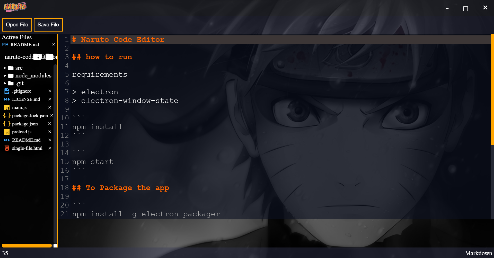

# Naruto Code Editor

A minimal, custom-built code editor powered by [Electron](https://www.electronjs.org/).



## Overview

Naruto Code Editor is a lightweight code editor designed for simplicity and ease of use. It features a file explorer, syntax highlighting via CodeMirror, and support for multiple programming languages. It allows users to manage files and folders, edit code with visual aids, and customize their coding environment.

## Features

*   **File Explorer**: Navigate through folders and files with an intuitive tree view.
*   **Syntax Highlighting**: Supports various languages including HTML, CSS, JavaScript, PHP, SQL, and more.
*   **Multi-tab Editing**: Open and edit multiple files simultaneously.
*   **Themes**: Includes a wide range of themes to customize the editor's appearance.
*   **Keyboard Shortcuts**: standard shortcuts for creating (Ctrl+N), opening (Ctrl+O), and saving (Ctrl+S) files.
*   **Window Management**: Custom title bar with minimize, maximize, and close controls.

## Prerequisites

Before you begin, ensure you have the following installed:

*   [Node.js](https://nodejs.org/) (which includes npm)

## Installation

1.  **Clone the repository:**
    ```bash
    git clone https://github.com/tghimanshu/naruto-code-editor-onefile.git
    cd naruto-code-editor-onefile
    ```

2.  **Install dependencies:**
    ```bash
    npm install
    ```

## Usage

### Running the App

To start the application in development mode:

```bash
npm start
```

### Packaging the App

To package the application for distribution, you can use `electron-packager`.

1.  **Install `electron-packager` globally (optional but recommended):**
    ```bash
    npm install -g electron-packager
    ```
    Or install it as a dev dependency:
    ```bash
    npm install electron-packager --save-dev
    ```

2.  **Package the app:**
    ```bash
    electron-packager .
    ```

## Project Structure

*   `main.js`: The main process entry point. Handles window creation and lifecycle events.
*   `preload.js`: Preload script for safe node integration (currently unused but prepared).
*   `src/`: Contains the source code for the renderer process.
    *   `js/`: Application logic files.
        *   `fileEditor.js`: Core logic for opening, saving, and managing files/folders.
        *   `globals.js`: Global variables and utility functions.
        *   `header.js`: Window control logic (minimize, maximize, close).
        *   `renderer.js`: Event listener bindings for main UI buttons.
        *   `settings.js`: Loads user settings (e.g., background).
        *   `shortcuts.js`: Keyboard shortcut handlers.
    *   `editor/`: CodeMirror library and assets.
    *   `index.html`: The main entry HTML file for the application window.
    *   `data/`: Stores JSON files for persistence (e.g., last opened folder).

## Contributing

Contributions are welcome! Please feel free to submit a Pull Request.

## License

[MIT](LICENSE.md)
